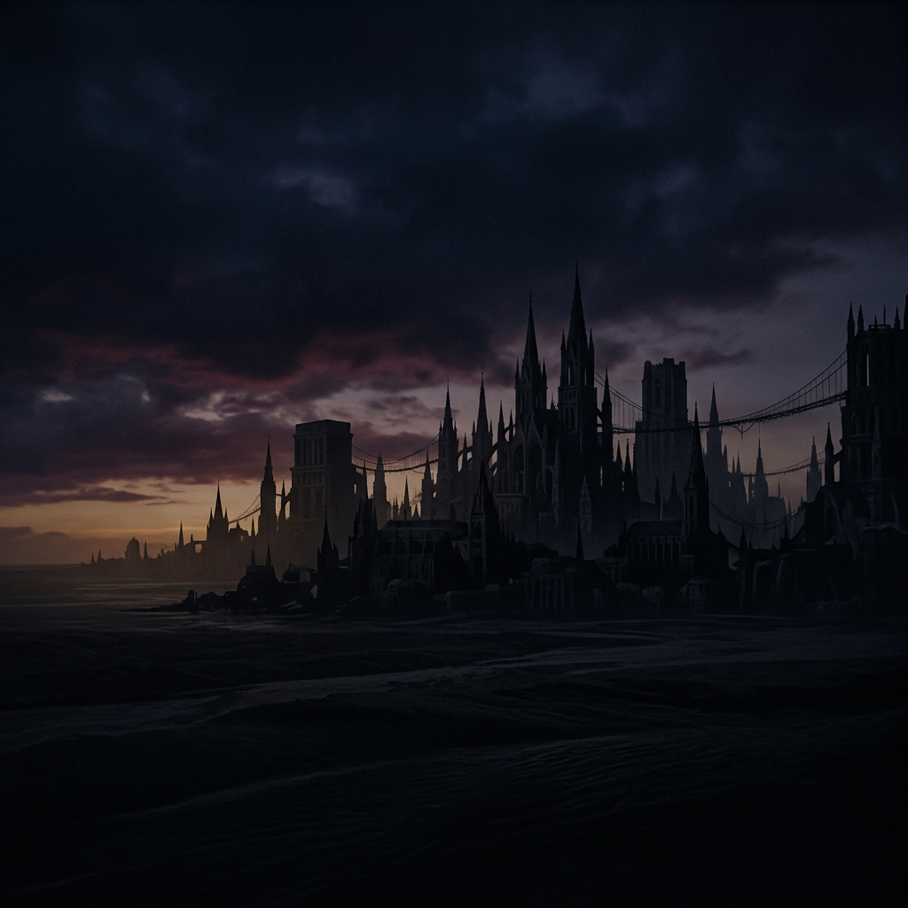

# Memory Loom



Memory Loom is a futuristic React + Vite dashboard experience that blends animated onboarding, timeline exploration, and paradox tracking into a single interactive interface.

## Live Demo

- Final deployment: https://memory-loom-three.vercel.app

## What It Does

Memory Loom is designed as a narrative control center for a simulated world. It features:

- Animated intro flow with a boot sequence and destination navigation
- A responsive dashboard shell with collapsible sidebar and mobile support
- Dedicated pages for:
  - **Overview**
  - **Timelines**
  - **Memories**
  - **Paradoxes**
  - **Universe Map**
  - **Settings**
- Custom animated components like integrity rings, ember bars, and loom canvas visuals
- A polished, neon-futuristic UI with layered scene backgrounds and motion-driven transitions

## Tech Stack

- React 19
- Vite 8
- Tailwind CSS 4
- React Router DOM 7
- lucide-react icons
- Oxlint for linting

## Project Structure

- `src/App.jsx` — routing and onboarding flow
- `src/main.jsx` — app bootstrap and render
- `src/index.css` — global styling and theme tokens
- `src/components/intro` — intro hero and boot animation
- `src/components/layout` — dashboard shell, sidebar, and topbar
- `src/components/loom-canvas` — Loom canvas simulation visuals
- `src/components/ui` — reusable UI primitives
- `src/pages` — page views for each dashboard section
- `src/context/SimulatorContext.jsx` — shared simulator state and hooks
- `src/data` — event, mission, timeline, paradox, and memory data sources

## Installation

```bash
npm install
```

## Run Locally

```bash
npm run dev
```

Then open `http://localhost:5173`

## Build

```bash
npm run build
```

## Preview Production Build

```bash
npm run preview
```

## Notes

- The dashboard uses nested routing inside `DashboardShell` to render each page.
- The intro flow moves from `/` to `/boot` and then into the main dashboard using router state.
- Visual styling is designed around a futuristic thread-and-loom aesthetic with animated status rings and event logs.
